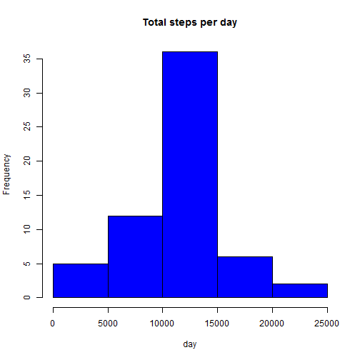

Peer Assesment 1 - Reproducible Research
=============================================================================

This is my submission for Peer Assesment 1 at Coursera 

First, I'm going to load the data and take a look at the dataset


```r
library(dplyr)
setwd("C:/Users/wkusnie/Documents/repdata_activity")
activity<- read.csv("activity.csv")
head(activity)
```

```
##   steps       date interval
## 1    NA 2012-10-01        0
## 2    NA 2012-10-01        5
## 3    NA 2012-10-01       10
## 4    NA 2012-10-01       15
## 5    NA 2012-10-01       20
## 6    NA 2012-10-01       25
```

Next, I'm going to build histogram with total number of steps taken each day


```r
activity_per_day<- activity %>% group_by(date) %>% summarise(total.steps=sum(steps))
hist(activity_per_day$total.steps,main = "Number of total steps per day")
```


Now, I'll count mean & median number of steps taken each day


```r
mean((activity_per_day$total.steps),na.rm = TRUE)
```

```
## [1] 10766.19
```

```r
median((activity_per_day$total.steps),na.rm = TRUE)
```

```
## [1] 10765
```

Now, I'll show time series plot of the average numbers of steps taken (5 minute intervals)


```r
steps_interval<- aggregate(steps ~ interval, data = activity,FUN = mean)
plot(steps_interval,type = "l")
```


Which interval has max number of steps?


```r
steps_interval$interval[which.max(steps_interval$steps)]
```

```
## [1] 835
```

Now, I'm gonna present the code to describe and show a strategy for imputting missing data


```r
fillNA <- numeric()
for (i in 1:nrow(activity)) {
        obs <- activity[i, ]
        if (is.na(obs$steps)) {
                steps <- subset(steps_interval, interval == obs$interval)$steps
                } else {
                        steps <- obs$steps
                        }
        fillNA <- c(fillNA, steps)
}
new_activity<- activity
new_activity$steps<- fillNA
```

Now, I'll show histogram with total number of steps taken each day after missing value imputed


```r
activity_per_day2<- aggregate(steps ~ date, data = new_activity,sum, na.rm = TRUE)
hist(activity_per_day2$steps,main = "Total steps per day", xlab = "day", col = "blue")
```



I'll count mean and median once again to see the differences


```r
mean(activity_per_day2$steps)
```

```
## [1] 10766.19
```

```r
median(activity_per_day2$steps)
```

```
## [1] 10766.19
```

Next task is panel plot: avg number of steps taken per 5-minute interval across weekdays vs. weekends


```r
type_day <- function(date) {
        if (weekdays(as.Date(date)) %in% c("Saturday", "Sunday")) {
                "weekend"
        } else {
                "weekday"
        }
}

activity$type_day <- as.factor(sapply(activity$date,type_day))

par(mfrow = c(2,1))
for(type in c("weekend","weekday")) {
        type_steps<- aggregate(steps ~ interval, data = activity, subset = activity$type_day == type, FUN = mean)
        plot(type_steps,type = "l", main = type)
}
```


